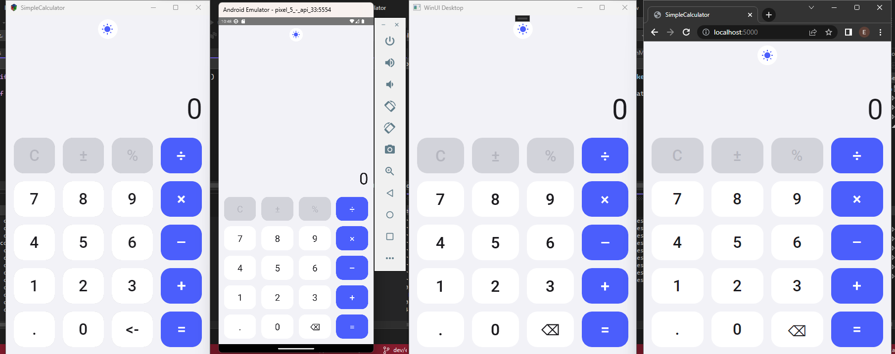

# Create a Single Page App with Uno Platform

[Download the complete sample](https://github.com/unoplatform/Uno.Samples/tree/feature/4_7/reference/SimpleCalculator)  

> [!NOTE] 
> Estimated time to complete: 30 minutes

In this tutorial you will learn how to:

- Add the Uno Platform Project Templates to Visual Studio
- Create a new Project with Uno Platform
- Use MVU-x and CSharp for Markup

The tutorial walks you through creating a cross platform application with Uno Platform - a Simple Calculator app - which enables you to see a single Issue entry.

<div class="NOTE alert alert-info">
<h5>Before you start the tutorial</h5>

[If you haven't prepared your dev environment for Uno Platform app development yet, the Setting up the Environment page will guide you through installing all the prerequisites.](get-started.md)

</div>

## Getting Started

1. Open Visual Studio and click on `Create new project`. 

    

1. Search for the `Uno` templates, select the `Uno Platform App` then click `Next`.

    

1. In the `Configure your new project` window, set the `Project name` to `SimpleCalculator`, choose where you would like to save your project and click the `Create` button.

    

    > [!IMPORTANT]
    > The C# and XAML snippets in this tutorial requires that the solution is named **SimpleCalculator**. Using a different name will result in build errors when you copy code from this tutorial into the solution.

1. Choose a list of platforms, including **WebAssembly** and **WinUI**

    

1. Right click on the Solution and select `Manage NuGet Packages for Solution` from the context menu.
    - Make sure to select **nuget.org** or **NuGet official package source** as the package source
    - Click on the Updates tab. Update the following packages to the latest stable version, if they're not up to date: `Uno.Core`, `Uno.WinUI`, `Uno.UI.WebAssembly` `Uno.Wasm.Bootstrap` and `Uno.Wasm.Bootstrap.DevServer`.
    - Click back on the Browse tab and install the following NuGet Packages to each of the projects in your solution:
        - `Uno.Toolkit.WinUI.Material`
        - `Uno.Material.WinUI`
        - `Uno.Extensions.Reactive.WinUI`
        - `Uno.WinUI.Markup`
        - `Uno.Material.WinUI.Markup`
        - `Uno.Toolkit.WinUI.Markup`
        - `Uno.Themes.WinUI.Markup`

1. [See the Material docs to add necessary resources for Colors andFonts](https://platform.uno/docs/articles/external/uno.themes/doc/material-getting-started.html?q=MaterialColors#getting-started)

1. Finally, you'll need to close any opened file in the editor, then close the solution or Visual Studio, then re-open it. This is a workaround for a Visual studio issue regarding the XAML editor.

## Setting up our Calculator

1. Add a Business folder in the Shared Project.

1. Add a new record and then paste in the following code:

    ```cs
    public record Calculator
    {
        private string Number { get; init; }
        private string Operator { get; init; }
        private double? Number1 { get; init; }
        private double? Number2 { get; init; }
        private bool IsNumber2Percentage { get; init; }
        private double? Result { get; init; }
        private bool HasOperator => !string.IsNullOrEmpty(Operator);
        private bool HasNumber => !string.IsNullOrEmpty(Number);
        private bool HasNumber1 => Number1 != null;
        private bool HasNumber2 => Number2 != null;

        public string Output => $"{(Result != null ? Result.Value : HasNumber ? Number : "0")}";
        public string Equation => $"{Number1} {Operator} {Number2}{(IsNumber2Percentage ? "%" : string.Empty)}{(Result != null ? " =" : string.Empty)}";

        public Calculator Input(string key)
            => Input(this, key);

        private Calculator Input(Calculator calculator, string key)
        {
            if (calculator.Result != null)
            {
                if (key == "÷" || key == "×" || key == "+" || key == "-")
                {
                    calculator = calculator with
                    {
                        Number1 = calculator.Result,
                        Result = null,
                        Number2 = null,
                        Number = null,
                        Operator = key,
                        IsNumber2Percentage = false
                    };
                }
                else
                {
                    calculator = new();
                }
            }

            if (key == "back")
            {
                if (calculator.HasNumber)
                {
                    calculator = calculator with
                    {
                        Number = calculator.Number?.Substring(0, calculator.Number.Length - 1)
                    };
                }
            }
            else if (key == ".")
            {
                if (calculator.HasNumber)
                {
                    if (calculator.Number?.Contains(".") == false)
                    {
                        calculator = calculator with
                        {
                            Number = calculator.Number + key
                        };
                    }
                }
                else
                {
                    calculator = calculator with
                    {
                        Number = "0" + key
                    };
                }
            }
            else if (key == "0")
            {
                if (calculator.HasNumber)
                {
                    calculator = calculator with
                    {
                        Number = calculator.Number + key
                    };
                }
            }
            else if (key == "C")
            {
                calculator = new();
            }
            else if (key == "=")
            {
                if (calculator.HasOperator && calculator.HasNumber1)
                {
                    double? number2 = calculator.HasNumber ? GetNumber(calculator.Number) : 0.0;
                    double? result = null;
                    switch (calculator.Operator)
                    {
                        case "÷":
                            result = calculator.Number1!.Value / number2!.Value;
                            break;
                        case "×":
                            result = calculator.Number1!.Value * number2!.Value;
                            break;
                        case "+":
                            result = calculator.Number1!.Value + number2!.Value;
                            break;
                        case "-":
                            result = calculator.Number1!.Value - number2!.Value;
                            break;
                    }

                    calculator = calculator with
                    {
                        Number2 = number2,
                        Result = result
                    };
                }
            }
            else if (key == "%")
            {
                if (calculator.HasOperator && calculator.HasNumber1)
                {
                    double? number2 = calculator.HasNumber ? GetNumber(calculator.Number) : 0.0;
                    double? result = null;
                    switch (calculator.Operator)
                    {
                        case "÷":
                            result = calculator.Number1!.Value / (number2!.Value / 100) * calculator.Number1!.Value;
                            break;
                        case "×":
                            result = calculator.Number1!.Value * (number2!.Value / 100) * calculator.Number1!.Value;
                            break;
                        case "+":
                            result = calculator.Number1!.Value + (number2!.Value / 100) * calculator.Number1!.Value;
                            break;
                        case "-":
                            result = calculator.Number1!.Value - (number2!.Value / 100) * calculator.Number1!.Value;
                            break;
                    }

                    calculator = calculator with
                    {
                        Number2 = number2,
                        Result = result,
                        IsNumber2Percentage = true
                    };
                }
            }
            else if (key == "+-")
            {
                if (calculator.HasNumber)
                {
                    calculator = calculator with { Number = calculator.Number?.StartsWith("-") == true ? calculator.Number?.Substring(1) : "-" + calculator.Number };
                }
            }
            else if (key == "÷" || key == "×" || key == "+" || key == "-")
            {
                if (calculator.HasNumber && !calculator.HasOperator)
                {
                    calculator = calculator with
                    {
                        Operator = key,
                        Number1 = GetNumber(calculator.Number),
                        Number = null
                    };
                }
            }
            else
            {
                calculator = calculator with { Number = calculator.Number + key };
            }

            return calculator;
        }

        double? GetNumber(string number)
        {
            return Convert.ToDouble(number);
        }
    }
    ```

## Setting up our Theme Service

1. In order to have Dark/Light theme switching let's add a folder named ThemeService in the Shared Project.

1. Add a new Interface `IAppThemeService` and then paste in the following code:

    ```cs
    public interface IAppThemeService
    {
        bool IsDark { get; }
        ValueTask SetThemeAsync(bool darkMode, CancellationToken ct);
    }
    ```

1. Now add a new class `AppThemeService` and paste in the following code:

    ```cs
    public class AppThemeService : IAppThemeService
    {
        private readonly Window _window;

        public AppThemeService()
        {
            _window = ((App)App.Current).Window;
        }

        public bool IsDark => SystemThemeHelper.IsRootInDarkMode(_window.Content.XamlRoot!);

        public async ValueTask SetThemeAsync(bool darkMode, CancellationToken ct)
        {
            var tcs = new TaskCompletionSource<object>();
            await using var _ = ct.Register(() => tcs.TrySetCanceled());
            _window.DispatcherQueue.TryEnqueue(() =>
            {
                if (!ct.IsCancellationRequested)
                {
                    SystemThemeHelper.SetRootTheme(_window.Content.XamlRoot, darkMode);
                }

                tcs.TrySetResult(default);
            });

            await tcs.Task;
        }
    }
    ```

## Setting up our Model

1. Add a Models folder in the Shared Project.

1. Add a new record and then paste in the following code:

    ```cs
    public partial record MainModel
    {
        public IState<bool> IsDark => State.Value(this, () => _theme.IsDark);

        public IState<Calculator> Calculator => State.Value(this, () => new Calculator());
        public async ValueTask Input(string key, CancellationToken ct)
                => await Calculator.Update(c => c?.Input(key), ct);
        public MainModel (IAppThemeService theme )
        {
            _theme = theme;
            IsDark.ForEachAsync((dark, ct) => theme.SetThemeAsync(dark, ct));
        }

        private readonly IAppThemeService _theme;
    }
    ```

## Setting up our Page

1. Create a new class `MainPageMarkup` and add the following code for our CSharp for Markup version.

    ```cs
    public sealed partial class MainPageMarkup : Page
    {
        public MainPageMarkup()
        {
            this.DataContext(new BindableMainModel(new AppThemeService()), (page, vm)
                => page
                .Resources(r => r
                    .Add("Icon_Brightness", "F1 M 3 0 C 1.9500000476837158 0 0.949999988079071 0.1600000262260437 0 0.46000003814697266 C 4.059999942779541 1.7300000190734863 7 5.519999980926514 7 10 C 7 14.480000019073486 4.059999942779541 18.27000093460083 0 19.540000915527344 C 0.949999988079071 19.840000927448273 1.9500000476837158 20 3 20 C 8.519999980926514 20 13 15.519999980926514 13 10 C 13 4.480000019073486 8.519999980926514 0 3 0 Z")
                    .Add("Icon_Wb_Sunny", "F1 M 5.760000228881836 4.289999961853027 L 3.9600000381469727 2.5 L 2.549999952316284 3.9100000858306885 L 4.340000152587891 5.699999809265137 L 5.760000228881836 4.289999961853027 Z M 3 9.949999809265137 L 0 9.949999809265137 L 0 11.949999809265137 L 3 11.949999809265137 L 3 9.949999809265137 Z M 12 0 L 10 0 L 10 2.950000047683716 L 12 2.950000047683716 L 12 0 L 12 0 Z M 19.450000762939453 3.9100000858306885 L 18.040000915527344 2.5 L 16.25 4.289999961853027 L 17.65999984741211 5.699999809265137 L 19.450000762939453 3.9100000858306885 Z M 16.239999771118164 17.610000610351562 L 18.030000686645508 19.40999984741211 L 19.440000534057617 18 L 17.639999389648438 16.21000099182129 L 16.239999771118164 17.610000610351562 Z M 19 9.949999809265137 L 19 11.949999809265137 L 22 11.949999809265137 L 22 9.949999809265137 L 19 9.949999809265137 Z M 11 4.949999809265137 C 7.690000057220459 4.949999809265137 5 7.639999866485596 5 10.949999809265137 C 5 14.259999752044678 7.690000057220459 16.950000762939453 11 16.950000762939453 C 14.309999942779541 16.950000762939453 17 14.259999752044678 17 10.949999809265137 C 17 7.639999866485596 14.309999942779541 4.949999809265137 11 4.949999809265137 Z M 10 21.900001525878906 L 12 21.900001525878906 L 12 18.950000762939453 L 10 18.950000762939453 L 10 21.900001525878906 Z M 2.549999952316284 17.990001678466797 L 3.9600000381469727 19.400001525878906 L 5.75 17.600000381469727 L 4.340000152587891 16.190000534057617 L 2.549999952316284 17.990001678466797 Z")
                )
                .Background(Theme.Brushes.Background.Default)
                .Content
                (
                    new AutoLayout()
                    .MaxWidth(700)
                    .SafeArea(SafeArea.InsetMask.VisibleBounds)
                    .Children
                    (
                        Header(vm),
                        Output(vm),
                        KeyPad(vm)
                    )
                )
            );
        }

        private ToggleButton Header(BindableMainModel vm)
           => new ToggleButton()
               .Margin(8)
               .CornerRadius(20)
               .AutoLayout(counterAlignment: AutoLayoutAlignment.Center)
               .Background(Theme.Brushes.Secondary.Container.Default)
               .Style(Theme.Styles.ToggleButton.Icon)
               .IsChecked(x => x.Bind(() => vm.IsDark).Mode(BindingMode.TwoWay))
               .Content
               (
                   new PathIcon()
                       .Data(StaticResource.Get<Geometry>("Icon_Wb_Sunny"))
                       .Foreground(Theme.Brushes.Primary.VariantDark.Default)
               )
               .ControlExtensions
               (
                   alternateContent:
                   new PathIcon()
                       .Data(StaticResource.Get<Geometry>("Icon_Brightness"))
                       .Foreground(Theme.Brushes.Primary.VariantDark.Default)
               );

        private AutoLayout Output(BindableMainModel vm)
            => new AutoLayout()
            .AutoLayout(primaryAlignment: AutoLayoutPrimaryAlignment.Stretch)
            .Spacing(16)
            .Padding(16, 8)
            .PrimaryAxisAlignment(AutoLayoutAlignment.End)
            .Children
            (
                Equation(vm),
                Result(vm)
            );
        
        private TextBlock Equation(BindableMainModel vm)
            => new TextBlock()
            .Text(() => vm.Calculator.Equation)
            .AutoLayout(counterAlignment: AutoLayoutAlignment.End)
            .Foreground(Theme.Brushes.OnSecondary.Container.Default)
            .Style(Theme.Styles.TextBlock.DisplaySmall);

        private TextBlock Result(BindableMainModel vm)
            => new TextBlock()
            .Text(() => vm.Calculator.Output)
            .AutoLayout(counterAlignment: AutoLayoutAlignment.End)
            .Foreground(Theme.Brushes.OnBackground.Default)
            .Style(Theme.Styles.TextBlock.DisplayLarge);

        private Grid KeyPad(BindableMainModel vm)
            => new Grid()
            .RowSpacing(16)
            .ColumnSpacing(16)
            .Padding(16)
            .MaxHeight(500)
            .ColumnDefinitions<Grid>("*,*,*,*")
            .RowDefinitions<Grid>("*,*,*,*,*")
            .Children
            (
                // Row 0
                KeyPadButton(vm, 0, 0, "C", "PrimaryContainerBrush", "OnSecondaryContainerBrush"),
                KeyPadButton(vm, 0, 1, "±", "PrimaryContainerBrush", "OnSecondaryContainerBrush", "+-"),
                KeyPadButton(vm, 0, 2, "%", "PrimaryContainerBrush", "OnSecondaryContainerBrush"),
                KeyPadButton(vm, 0, 3, "÷", "PrimaryVariantDarkBrush", "OnTertiaryBrush"),

                // Row 1
                KeyPadButton(vm, 1, 0, "7"),
                KeyPadButton(vm, 1, 1, "8"),
                KeyPadButton(vm, 1, 2, "9"),
                KeyPadButton(vm, 1, 3, "×", "PrimaryVariantDarkBrush", "OnTertiaryBrush"),

                // Row 2
                KeyPadButton(vm, 2, 0, "4"),
                KeyPadButton(vm, 2, 1, "5"),
                KeyPadButton(vm, 2, 2, "6"),
                KeyPadButton(vm, 2, 3, "–", "PrimaryVariantDarkBrush", "OnTertiaryBrush", parameter: "-"),

                //Row 3
                KeyPadButton(vm, 3, 0, "1"),
                KeyPadButton(vm, 3, 1, "2"),
                KeyPadButton(vm, 3, 2, "3"),
                KeyPadButton(vm, 3, 3, "+", "PrimaryVariantDarkBrush", "OnTertiaryBrush"),

                //Row 4
                KeyPadButton(vm, 4, 0, "."),
                KeyPadButton(vm, 4, 1, "0"),
                #if HAS_UNO_SKIA
                KeyPadButton(vm, 4, 2, "<-", parameter: "back"),
                #else
                KeyPadButton(vm, 4, 2, "⌫", parameter: "back"),
                #endif
                KeyPadButton(vm, 4, 3, "=", "PrimaryVariantDarkBrush", "OnTertiaryBrush")
            );

        private Button KeyPadButton(BindableMainModel vm, int gridRow, int gridColumn, string content, string background = "SecondaryContainerBrush", string foreground = "OnSurfaceBrush", string parameter = null)
            => new Button()
            .Command(() => vm.Input)
            .CommandParameter(parameter ?? content)
            .Background(ThemeResource.Get<Brush>(background))
            .Content(content)
            .FontSize(32)
            .Foreground(ThemeResource.Get<Brush>(foreground))
            .Grid(row: gridRow, column: gridColumn)
            .HorizontalAlignment(HorizontalAlignment.Stretch)
            .VerticalAlignment(VerticalAlignment.Stretch)
            .Height(72);
    }
    ```
1. Let's also add a Xaml version for our Calculator. Double-click **MainPage.xaml** to open it.
1. Then we'll add some XAML.

    ```xml
    <Page
    x:Class="SimpleCalculator.MainPage"
    xmlns="http://schemas.microsoft.com/winfx/2006/xaml/presentation"
    xmlns:x="http://schemas.microsoft.com/winfx/2006/xaml"
    xmlns:local="using:SimpleCalculator"
    xmlns:keyboard="using:SimpleCalculator.Keyboard"
    xmlns:d="http://schemas.microsoft.com/expression/blend/2008"
    xmlns:mc="http://schemas.openxmlformats.org/markup-compatibility/2006"
    xmlns:skia="http://uno.ui/skia"
    mc:Ignorable="d skia"   
    xmlns:uer="using:Uno.Extensions.Reactive.UI"
    xmlns:not_skia="http://schemas.microsoft.com/winfx/2006/xaml/presentation"
    xmlns:utu="using:Uno.Toolkit.UI"
    xmlns:um="using:Uno.Material"
    Background="{ThemeResource BackgroundBrush}"
    keyboard:KeyboardBehavior.KeyUpCommand="{Binding Input}">

        <Page.Resources>
            <x:String x:Key="Icon_Brightness_3">F1 M 3 0 C 1.9500000476837158 0 0.949999988079071 0.1600000262260437 0 0.46000003814697266 C 4.059999942779541 1.7300000190734863 7 5.519999980926514 7 10 C 7 14.480000019073486 4.059999942779541 18.27000093460083 0 19.540000915527344 C 0.949999988079071 19.840000927448273 1.9500000476837158 20 3 20 C 8.519999980926514 20 13 15.519999980926514 13 10 C 13 4.480000019073486 8.519999980926514 0 3 0 Z</x:String>
            <x:String x:Key="Icon_Wb_Sunny">F1 M 5.760000228881836 4.289999961853027 L 3.9600000381469727 2.5 L 2.549999952316284 3.9100000858306885 L 4.340000152587891 5.699999809265137 L 5.760000228881836 4.289999961853027 Z M 3 9.949999809265137 L 0 9.949999809265137 L 0 11.949999809265137 L 3 11.949999809265137 L 3 9.949999809265137 Z M 12 0 L 10 0 L 10 2.950000047683716 L 12 2.950000047683716 L 12 0 L 12 0 Z M 19.450000762939453 3.9100000858306885 L 18.040000915527344 2.5 L 16.25 4.289999961853027 L 17.65999984741211 5.699999809265137 L 19.450000762939453 3.9100000858306885 Z M 16.239999771118164 17.610000610351562 L 18.030000686645508 19.40999984741211 L 19.440000534057617 18 L 17.639999389648438 16.21000099182129 L 16.239999771118164 17.610000610351562 Z M 19 9.949999809265137 L 19 11.949999809265137 L 22 11.949999809265137 L 22 9.949999809265137 L 19 9.949999809265137 Z M 11 4.949999809265137 C 7.690000057220459 4.949999809265137 5 7.639999866485596 5 10.949999809265137 C 5 14.259999752044678 7.690000057220459 16.950000762939453 11 16.950000762939453 C 14.309999942779541 16.950000762939453 17 14.259999752044678 17 10.949999809265137 C 17 7.639999866485596 14.309999942779541 4.949999809265137 11 4.949999809265137 Z M 10 21.900001525878906 L 12 21.900001525878906 L 12 18.950000762939453 L 10 18.950000762939453 L 10 21.900001525878906 Z M 2.549999952316284 17.990001678466797 L 3.9600000381469727 19.400001525878906 L 5.75 17.600000381469727 L 4.340000152587891 16.190000534057617 L 2.549999952316284 17.990001678466797 Z</x:String>
        </Page.Resources>

        <utu:AutoLayout utu:SafeArea.Insets="VisibleBounds" MaxWidth="700" Padding="0,0,0,16" Background="{ThemeResource BackgroundBrush}" PrimaryAxisAlignment="End">
            <ToggleButton Background="{ThemeResource SecondaryContainerBrush}" Margin="8" utu:AutoLayout.CounterAlignment="Center" Style="{StaticResource IconToggleButtonStyle}" IsChecked="{Binding IsDark, Mode=TwoWay}" CornerRadius="20">
                <ToggleButton.Content>
                    <PathIcon Data="{StaticResource Icon_Wb_Sunny}" Foreground="{ThemeResource PrimaryVariantDarkBrush}" />
                </ToggleButton.Content>
                <um:ControlExtensions.AlternateContent>
                    <PathIcon Data="{StaticResource Icon_Brightness_3}" Foreground="{ThemeResource PrimaryVariantDarkBrush}" />
                </um:ControlExtensions.AlternateContent>
            </ToggleButton>
            <utu:AutoLayout Spacing="16" Padding="16,8" PrimaryAxisAlignment="End" utu:AutoLayout.PrimaryAlignment="Stretch">
                <TextBlock Text="{Binding Calculator.Equation}" utu:AutoLayout.CounterAlignment="End" Foreground="{ThemeResource OnSecondaryContainerBrush}" Style="{StaticResource DisplaySmall}" />
                <TextBlock Text="{Binding Calculator.Output}" utu:AutoLayout.CounterAlignment="End" Foreground="{ThemeResource OnBackgroundBrush}" Style="{StaticResource DisplayLarge}" />
            </utu:AutoLayout>
            <utu:AutoLayout MaxHeight="500" Spacing="16" Padding="16,0">
                <utu:AutoLayout Spacing="16" Orientation="Horizontal" Height="72">
                    <Button Command="{Binding Input}" FontSize="32" CommandParameter="C" Background="{ThemeResource PrimaryContainerBrush}" Content="C" utu:AutoLayout.PrimaryAlignment="Stretch" Foreground="{ThemeResource OnSecondaryContainerBrush}" />
                    <Button Command="{Binding Input}" FontSize="32" CommandParameter="+-" Background="{ThemeResource PrimaryContainerBrush}" Content="±" utu:AutoLayout.PrimaryAlignment="Stretch" Foreground="{ThemeResource OnSecondaryContainerBrush}" />
                    <Button Command="{Binding Input}" FontSize="32" CommandParameter="%" Background="{ThemeResource PrimaryContainerBrush}" Content="%" utu:AutoLayout.PrimaryAlignment="Stretch" Foreground="{ThemeResource OnSecondaryContainerBrush}" />
                    <Button Command="{Binding Input}" FontSize="32" CommandParameter="÷" Background="{ThemeResource PrimaryVariantDarkBrush}" Content="÷" utu:AutoLayout.PrimaryAlignment="Stretch" Foreground="{ThemeResource OnTertiaryBrush}" />
                </utu:AutoLayout>
                <utu:AutoLayout Spacing="16" Orientation="Horizontal" Height="72">
                    <Button Command="{Binding Input}" FontSize="32" CommandParameter="7" Background="{ThemeResource SecondaryContainerBrush}" Content="7" utu:AutoLayout.PrimaryAlignment="Stretch" Foreground="{ThemeResource OnSurfaceBrush}" />
                    <Button Command="{Binding Input}" FontSize="32" CommandParameter="8" Background="{ThemeResource SecondaryContainerBrush}" Content="8" utu:AutoLayout.PrimaryAlignment="Stretch" Foreground="{ThemeResource OnSurfaceBrush}" />
                    <Button Command="{Binding Input}" FontSize="32" CommandParameter="9" Background="{ThemeResource SecondaryContainerBrush}" Content="9" utu:AutoLayout.PrimaryAlignment="Stretch" Foreground="{ThemeResource OnSurfaceBrush}" />
                    <Button Command="{Binding Input}" FontSize="32" CommandParameter="×" Background="{ThemeResource PrimaryVariantDarkBrush}" Content="×" utu:AutoLayout.PrimaryAlignment="Stretch" Foreground="{ThemeResource OnTertiaryBrush}" />
                </utu:AutoLayout>
                <utu:AutoLayout Spacing="16" Orientation="Horizontal" Height="72">
                    <Button Command="{Binding Input}" FontSize="32" CommandParameter="4" Background="{ThemeResource SecondaryContainerBrush}" Content="4" utu:AutoLayout.PrimaryAlignment="Stretch" Foreground="{ThemeResource OnSurfaceBrush}" />
                    <Button Command="{Binding Input}" FontSize="32" CommandParameter="5" Background="{ThemeResource SecondaryContainerBrush}" Content="5" utu:AutoLayout.PrimaryAlignment="Stretch" Foreground="{ThemeResource OnSurfaceBrush}" />
                    <Button Command="{Binding Input}" FontSize="32" CommandParameter="6" Background="{ThemeResource SecondaryContainerBrush}" Content="6" utu:AutoLayout.PrimaryAlignment="Stretch" Foreground="{ThemeResource OnSurfaceBrush}" />
                    <Button Command="{Binding Input}" FontSize="32" CommandParameter="-" Background="{ThemeResource PrimaryVariantDarkBrush}" Content="−" utu:AutoLayout.PrimaryAlignment="Stretch" Foreground="{ThemeResource OnTertiaryBrush}" />
                </utu:AutoLayout>
                <utu:AutoLayout Spacing="16" Orientation="Horizontal" Height="72">
                    <Button Command="{Binding Input}" FontSize="32" CommandParameter="1" Background="{ThemeResource SecondaryContainerBrush}" Content="1" utu:AutoLayout.PrimaryAlignment="Stretch" Foreground="{ThemeResource OnSurfaceBrush}" />
                    <Button Command="{Binding Input}" FontSize="32" CommandParameter="2" Background="{ThemeResource SecondaryContainerBrush}" Content="2" utu:AutoLayout.PrimaryAlignment="Stretch" Foreground="{ThemeResource OnSurfaceBrush}" />
                    <Button Command="{Binding Input}" FontSize="32" CommandParameter="3" Background="{ThemeResource SecondaryContainerBrush}" Content="3" utu:AutoLayout.PrimaryAlignment="Stretch" Foreground="{ThemeResource OnSurfaceBrush}" />
                    <Button Command="{Binding Input}" FontSize="32" CommandParameter="+" Background="{ThemeResource PrimaryVariantDarkBrush}" Content="+" utu:AutoLayout.PrimaryAlignment="Stretch" Foreground="{ThemeResource OnTertiaryBrush}" />
                </utu:AutoLayout>
                <utu:AutoLayout Spacing="16" Orientation="Horizontal" Height="72">
                    <Button Command="{Binding Input}" FontSize="32" CommandParameter="." Background="{ThemeResource SecondaryContainerBrush}" Content="." utu:AutoLayout.PrimaryAlignment="Stretch" Foreground="{ThemeResource OnSurfaceBrush}" />
                    <Button Command="{Binding Input}" FontSize="32" CommandParameter="0" Background="{ThemeResource SecondaryContainerBrush}" Content="0" utu:AutoLayout.PrimaryAlignment="Stretch" Foreground="{ThemeResource OnSurfaceBrush}" />
                    <Button Command="{Binding Input}" FontSize="32" CommandParameter="back" Background="{ThemeResource SecondaryContainerBrush}" not_skia:Content="⌫" skia:Content="&lt;-" utu:AutoLayout.PrimaryAlignment="Stretch" Foreground="{ThemeResource OnSurfaceBrush}" />
                    <Button Command="{Binding Input}" FontSize="32" CommandParameter="=" Background="{ThemeResource PrimaryVariantDarkBrush}" Content="=" utu:AutoLayout.PrimaryAlignment="Stretch" Foreground="{ThemeResource OnTertiaryBrush}" />
                </utu:AutoLayout>
            </utu:AutoLayout>
        </utu:AutoLayout>
    </Page>
    ```
1. Next let's bind our auto generated ViewModel to our Page. Double-click **MainPage.xaml.cs** to open, then add the following code.

    ```cs
    public sealed partial class MainPage : Page
    {
        public MainPage()
        {
            this.InitializeComponent();
            DataContext = new BindableMainModel(new AppThemeService());
        }
    }
    ```

## The final result

You should see something similar to the screenshot below. You can [download the completed tutorial code here](https://github.com/unoplatform/Uno.Samples/tree/feature/4_7/reference/SimpleCalculator).



<div class="NOTE alert alert-info">
<h5>Next:</h5>

[Got questions? Want to learn more? Looking for production-ready examples? Check out the Next Steps page.](get-started-next-steps.md) 

</div>